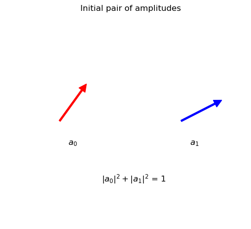
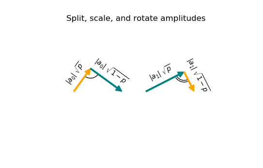
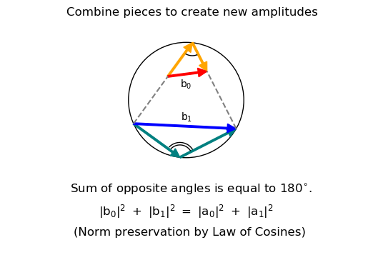

# Quantum Gate Geometry
A generalized visualization of applying single-qubit quantum gates.

We begin with our initial pair of amplitudes, a0 and a1. 

When applying a quantum gate, each amplitude is split into two components. 
We can view these two components as the sides to a triangle, with the hypotenuse being our original amplitude. 
The components are vectors whose sum is, again, the original amplitude. The angle between the components is determined 
by the gate. Importantly, the sum of the angles between the pairs of broken components is 180&deg;.

As shown in the image, we recombine the components to create two new amplitudes (labelled b0 and b1). Each pair uses complimentary probability 
terms as color coded in the previous figure. 
